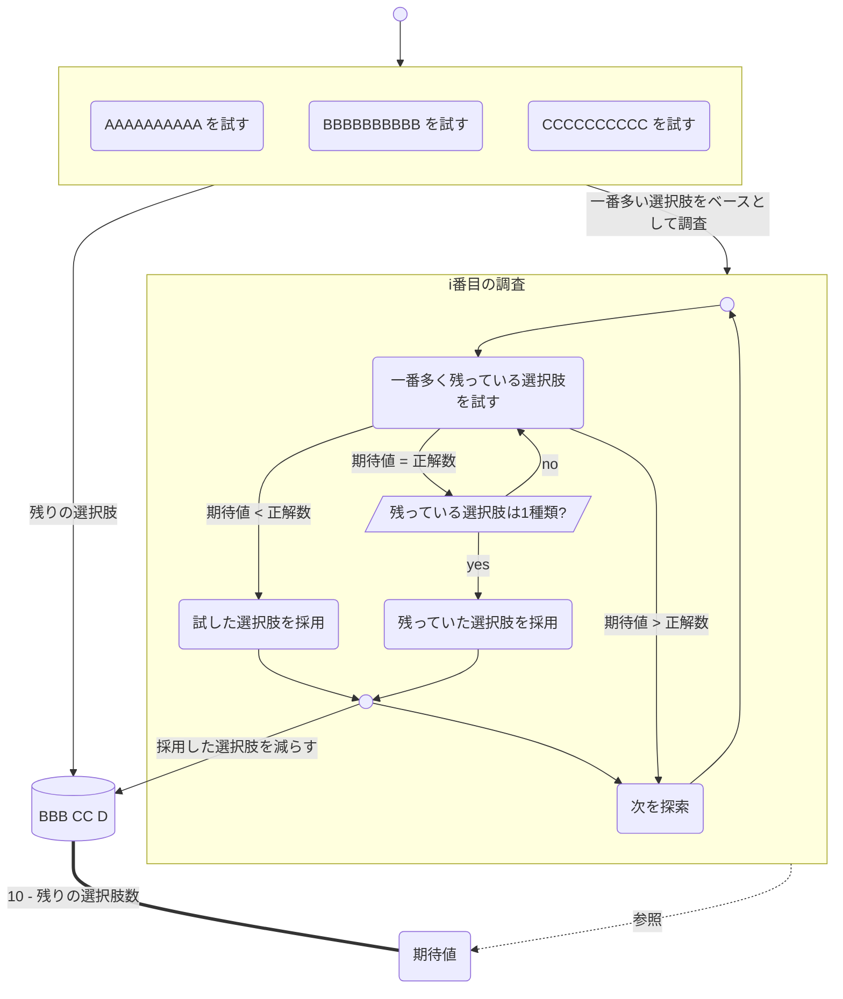

# README.md

```
AAAAAAAAAA
your score is 2

BBBBBBBBBB
your score is 4

CCCCCCCCCC
your score is 3
```

| 試行回数 | 未使用 | 試した回答 | 結果 | → | 確定 | 期待値 | 解説 |
| --- | --- | --- | --- | --- | --- | --- | --- |
| 3 | AA CCC D |  |  |  |  | 4 | 全てA, 全てB, 全てCを試し最大の正解数を期待値とする|
| 4 | AA CCC D | CBBBBBBBBB | 3 |  | B | 4 | 結果 < 期待値なので次を探索|
| 5 | AA CCC D | BCBBBBBBBB | 5 |  | BC | 5 | 結果 > 期待値なので使った選択肢を採用、期待値+1 |
| 6 | AA CC D | BCCBBBBBBB | 6 |  | BCC | 6 | 結果 > 期待値なので使った選択肢を採用、 期待値+1 |
| 7 | AA C D | BCCABBBBBB | 6 |  | BCC | 6 | 結果 = 期待値なので再試行 |
| 8 | AA C | BCCCBBBBBB | 6 |  | BCCD | 7 | 結果 = 期待値なので残った選択肢を採用、期待値+1 |
| 9 | A C | BCCDABBBBB | 8 |  | BCCDA | 8 | 結果 > 期待値なので使った選択肢を採用、期待値+1 |
| 10 | A C | BCCDAABBBB | 7 |  | BCCDAB | 8 | 結果 < 期待値なので次を探索 |
| 11 | A C | BCCDABABBB | 8 |  | BCCDABC | 9 | 結果 = 期待値なので残った選択肢を採用、期待値+1 |
| 12 | A | BCCDABCABB | 8 |  | BCCDABCA | 9 | 結果 > 期待値なので使った選択肢を採用、期待値+1 |
| 13 | A | BCCDABCBAB | 10 |  |  |  |


